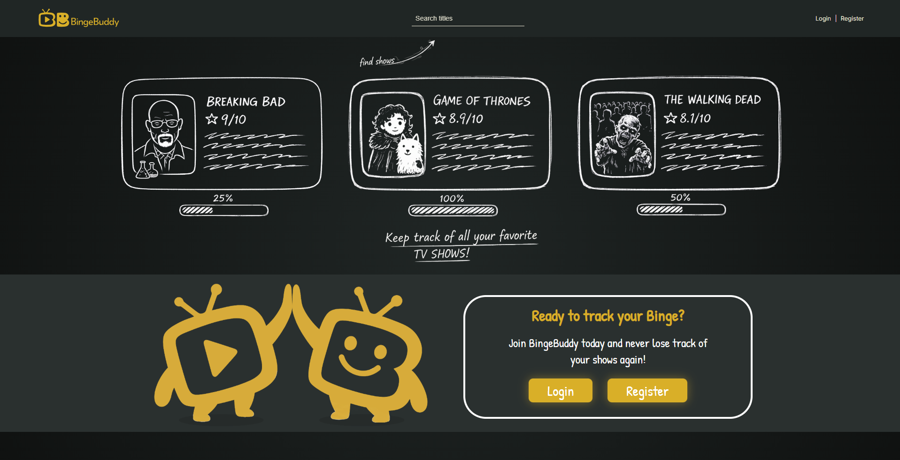
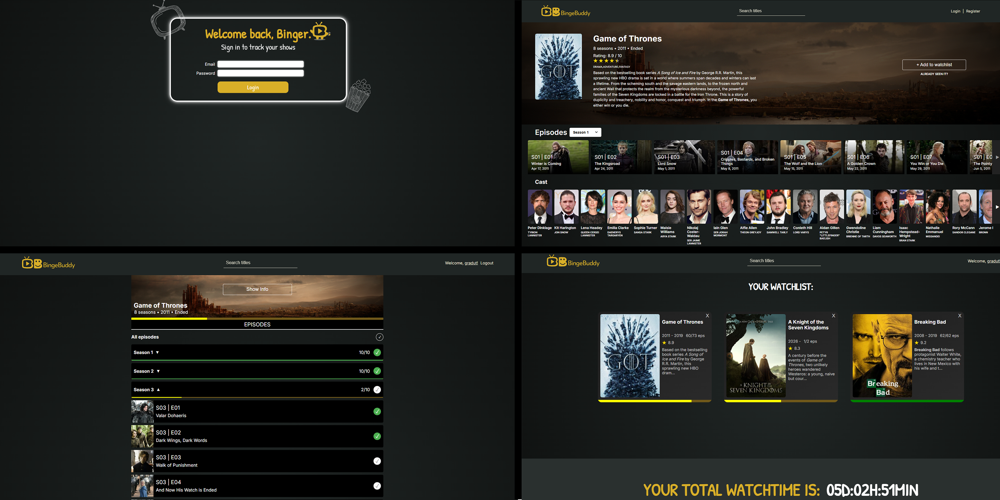

# BingeBuddy – TV Series Tracker
BingeBuddy is a TV series tracking app built with React and Vite that helps you discover new shows, track your progress, and manage your personal watchlist.
Users can browse shows, see details, register and log in, and keep track of watched episodes in a clean, playful interface.

   

## Setup Instructions Follow these steps to run the project locally: 
###  Clone the repository 
# 1. Install dependencies
npm install
# 2. Start API server
npm run server
# 3. Start frontend
npm run dev

Main features:
- Browse a curated list of TV shows with ratings, images and summaries
- View detailed show pages with episodes and meta information
- User authentication (register, login, protected routes)
- Personal watchlist / tracking:
  - Add shows to your list
  - Track watched vs released episodes
  - See progress for each show (percentage watched)
- User profile page with your tracked shows
- Toast notifications for feedback (success/error)
- Responsive layout and custom illustration-style UI

## Tech Stack
- **React** (functional components, hooks)
- **Vite** (bundler & dev server)
- **React Router v7** for client‑side routing
- **Zod** for form validation
- **React Toastify** for notifications
- **Custom CSS** for styling
- **json-server / json-server-auth** for local development
- **my-json-server** for the public mock API

